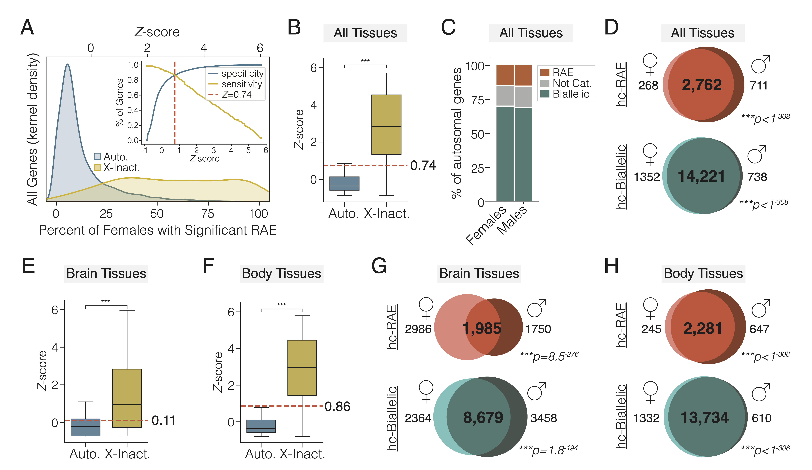

# human-rae-manuscript
 code used for figure generation and statistical analysis for manuscript

## Random Allelic Expression in the Human Body

### Stephanie N. Kravitz, Aaron R. Quinlan, Christopher Gregg

This repository contains the necessary Jupyter Notebooks and data files to reproduce analyses and figures in the manuscript. 

For example, below is Figure 2 from the manuscript which illustrates the robust separation of autosomal and random allelic X-linked genes from bulk RNA-Seq data allele-specific expression datasets (GTEx). The components of this figure can be generated individually using this repository.



All notebooks to re-create figures are in the [notebooks](https://github.com/quinlan-lab/human-rae-manuscript/tree/main/notebooks) folder of the repo. Each notebook is labeleled according to the corresponding manuscript figure (i.e. `figure2.ipynb`), which can be used to reproduce figures in the manuscript (minus some minor aesthetic formatting) using the data files in [data](https://github.com/quinlan-lab/human-rae-manuscript/tree/main/data). All data files are also available in the Supplement of the manuscript. The statistical analyses associated with each figure can be generated alongside the figures in the notebook. Figures in the manuscript were generated with the versions of each library listed below, though more recent versions (if applicable) will likely work, as well.

#### Dependencies

#### For `python 3.9.7`:

`scipy v1.7.1`

`seaborn v0.11.1`

`matplotlib v3.0.3`

`numpy v1.21.3`

`pandas v1.3.4`


#### Installation

Simply clone the repository and run a notebook as follows:

```
git clone https://github.com/quinlan-lab/human-rae-manuscript

cd human-rae-manuscript/notebooks

jupyter lab figure2.ipynb

